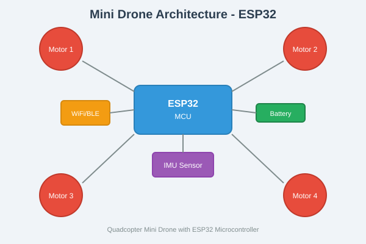

# MiniDrone-Ver1

A mini drone project using ESP32 as the main microcontroller unit (MCU).

## Project Overview

This project aims to build a compact, programmable quadcopter drone powered by the ESP32 microcontroller. The ESP32 provides excellent capabilities for drone applications including:

- Dual-core processor for real-time flight control
- Built-in WiFi and Bluetooth for remote control and telemetry
- Multiple GPIO pins for motor control and sensor interfaces
- Low power consumption for extended flight time

## Features

- **Flight Controller**: ESP32-based flight control system
- **Motors**: 4 brushless motors in quadcopter configuration
- **IMU Sensor**: Gyroscope and accelerometer for stability
- **Wireless Control**: WiFi/BLE remote control capability
- **Battery**: LiPo battery power system

## Hardware Components

| Component | Description |
|-----------|-------------|
| ESP32 | Main MCU for flight control |
| Motors (x4) | Brushless DC motors |
| ESC (x4) | Electronic Speed Controllers |
| IMU | MPU6050/MPU9250 sensor |
| Battery | 3.7V LiPo |
| Frame | Lightweight drone frame |

## Getting Started

### Prerequisites

- ESP32 development board
- Arduino IDE or PlatformIO
- ESP32 board support package

### Installation

1. Clone this repository
2. Open the project in your preferred IDE
3. Install required dependencies
4. Upload the firmware to your ESP32

## License

This project is open source.

## Contributing

Contributions are welcome! Please feel free to submit a Pull Request